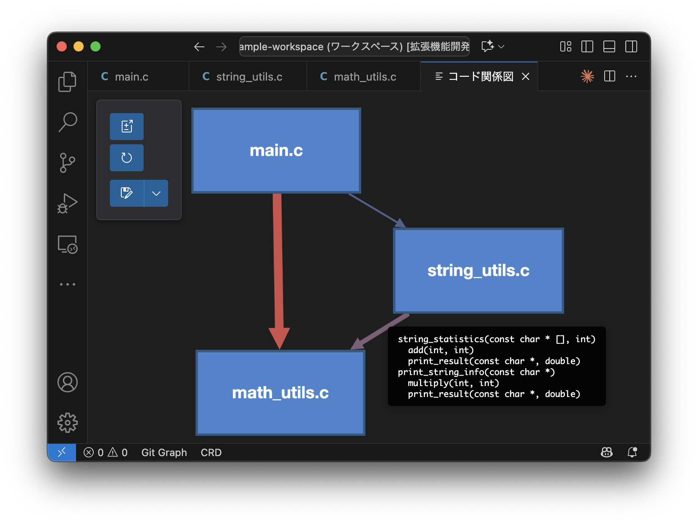

# vscode-code-relationship-diagram

コードの関係図でソフトウェア全体を俯瞰しながら育てる事を目指しています。  
コードと連携した図で、ソフトウェアの形を見える様にします。  
良い設計のソフトウェアは、美しく見えると思います。  
`Visual Studio Code`の拡張機能として動作します。



## Operation

- 0.準備
  - ワークスペースファイルに`files.associations`を定義し、ワークスペースで開く。

    ``` json
    {

      "settings": {
            
        "files.associations": {
          "src/**/*.(c|h)": "c"
        }
      }
    }
    ```

- 1.定義(シンボル)をデータベースに保存する。
  - a) `Ctrl(⌘)+Shift(⇧)+P`キーを押し、コマンドパレットを出力する。
  - b) `CRD: Initialize Code Relationship Diagram`コマンドを選ぶ。
- 2.関係図を表示する。
  - a) `Ctrl(⌘)+Shift(⇧)+P`キーを押し、コマンドパレットを出力する。
  - b) `CRD: Show Code Relationship Diagram`コマンドを選ぶ。

## Supported languages

- 1.システム言語 (10): C/C++, Rust, Go, Zig, Nim, D, Crystal, Carbon, V, Odin
- 2.Web開発 (18): JavaScript, TypeScript, HTML, CSS, SCSS, Less, PHP, Vue, Svelte, Angular, React, Astro, SolidJS, Ember, Lit, Stencil
- 3.モバイル/ゲーム開発 (9): Swift, Kotlin, Dart, Flutter, Objective-C, Xamarin, React Native, Unity, GDScript
- 4.関数型言語 (9): Haskell, OCaml, F#, Clojure, Elixir, Erlang, Scheme, Racket, Common Lisp
- 5.JVM言語 (2): Java, Groovy
- 6.スクリプト言語 (9): Python, Ruby, Lua, Perl, R, Julia, Tcl, AWK, SED
- 7.設定・マークアップ (18): JSON, XML, YAML, Markdown, TOML, INI, Dockerfile, Terraform, Makefile, CMake, Bazel, Gradle, Ant, Maven, SBT, Ninja, Meson
- 8.シェル (5): ShellScript, PowerShell, Bash, Zsh, Fish
- 9.データベース (5): SQL Server, MySQL, PostgreSQL, SQLite, MongoDB
- 10.アセンブリ・低レベル (7): x86-64 ASM, NASM, GAS, MASM, ARM, RISC-V, WebAssembly
- 11.ブロックチェーン (6): Solidity, Vyper, Move, Cairo, Clarity, Cadence
- 12.科学計算・データサイエンス (7): MATLAB, Octave, Scilab, Fortran, COBOL, Mathematica, SageMath
- 13.GPU・並列プログラミング (5): CUDA, OpenCL, HLSL, GLSL, Metal
- 14.ゲーム開発 (3): GDScript, UnrealScript, ActionScript
- 15.特殊DSL・ツール (7): Regex, Graphviz, PlantUML, Mermaid, LaTeX, BibTeX, Gnuplot
- 16.歴史的・教育言語 (6): Pascal, BASIC, Logo, Smalltalk, Forth, Prolog
- 17.エソテリック言語 (2): Brainfuck, Whitespace

## Development

### Excluding database and log files from Git

この拡張機能は`.vscode`ディレクトリにデータベースファイルとログファイルを生成します。  
これらのファイルをGit履歴管理から除外するには、プロジェクトの`.gitignore`ファイルに以下を追加してください：  

``` text
.vscode/crd.duckdb
.vscode/crd.duckdb.wal
.vscode/crd-*.log
```

既に追跡されているファイルがある場合は、以下のコマンドでGitインデックスから削除してください（ローカルファイルは保持されます）：

```bash
git rm --cached .vscode/crd.duckdb
git rm --cached .vscode/crd.duckdb.wal
```
